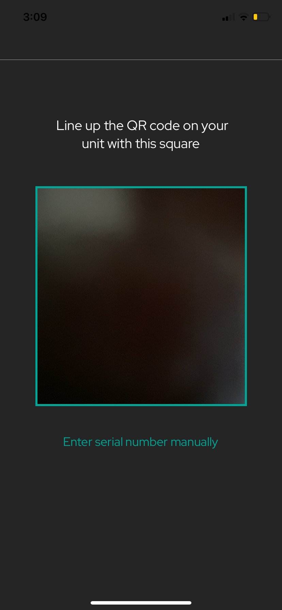
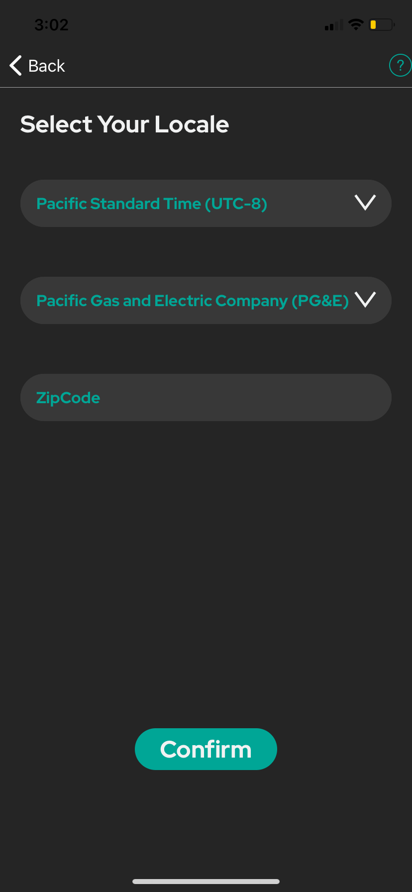
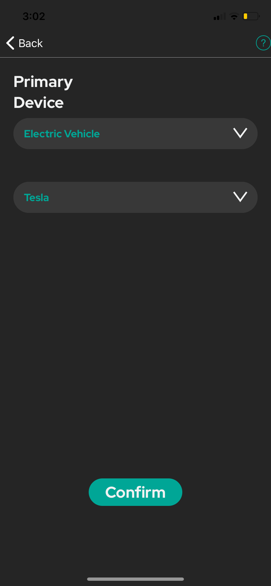
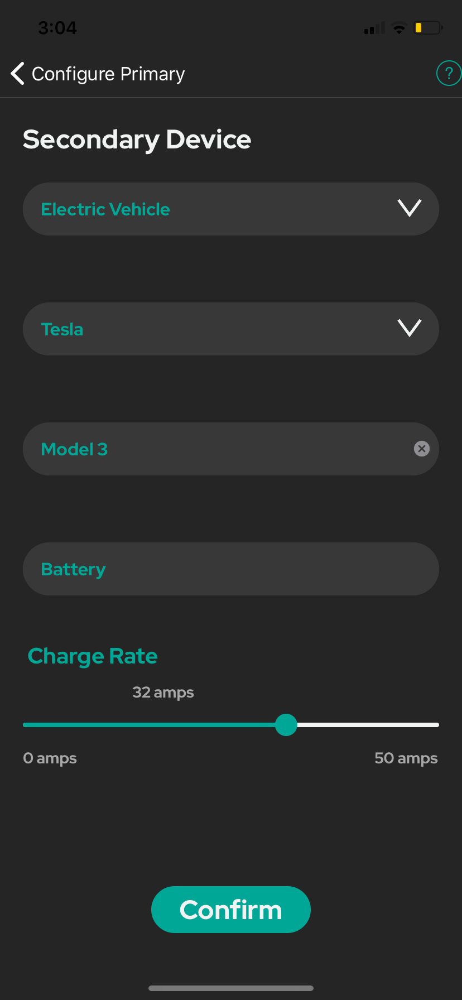
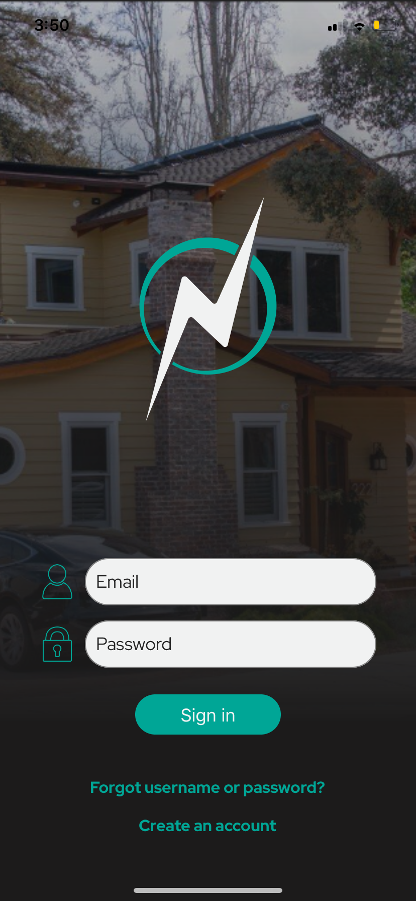
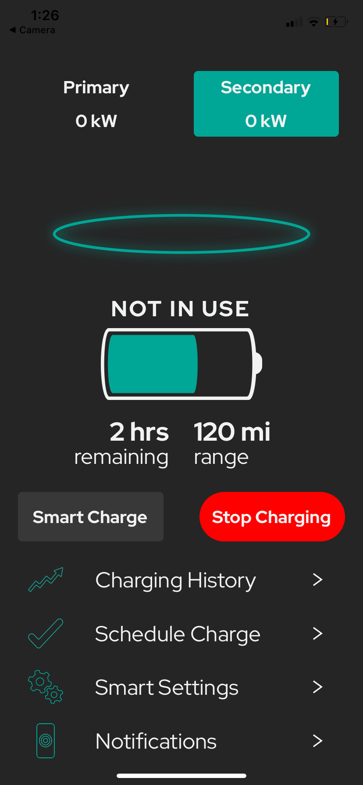
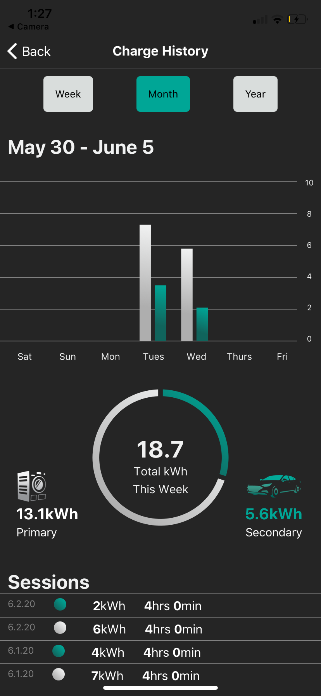
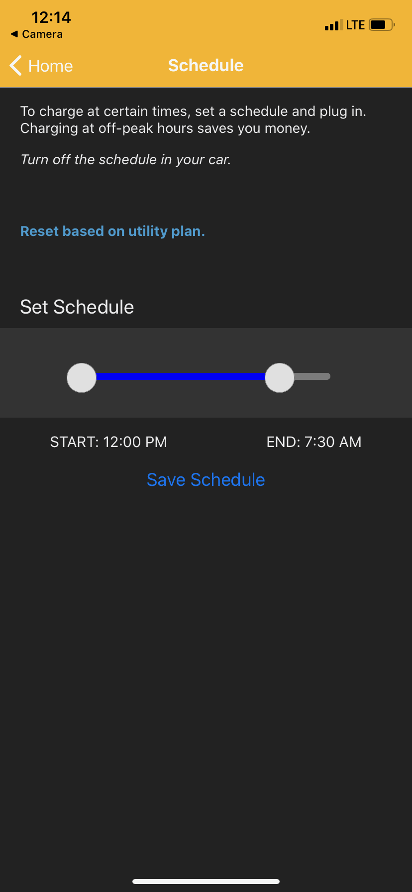
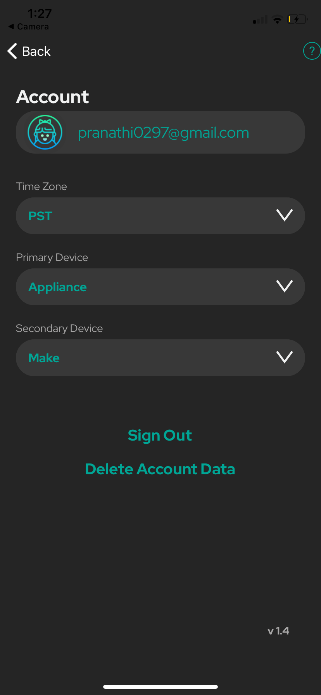
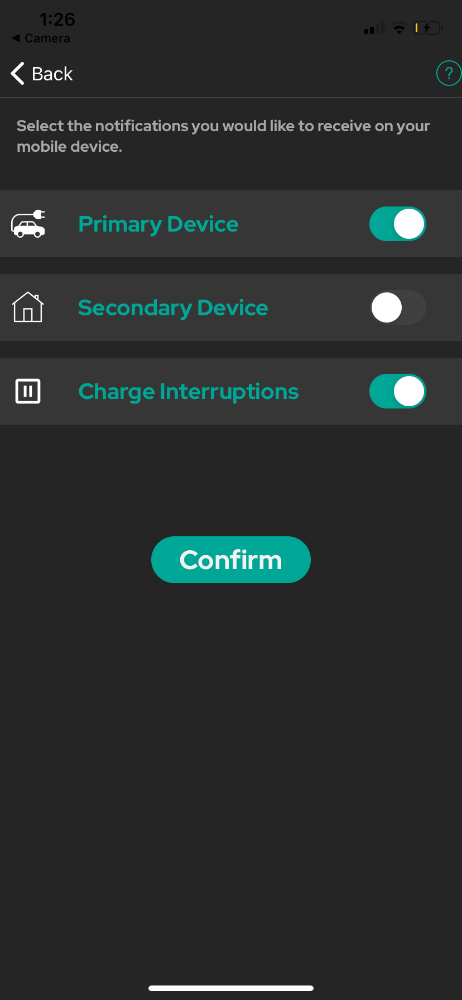

# Installation and Usage

## Installing Application
### IOS Users:

Begin by first installing the TestFlight IOS app onto your mobile device. To start running the application, accept the invitation sent to you either in the TestFlight iOS app or with a redemption code found via a link in the beta invitation. Once accepted you can install the prerelease build. The TestFlight app will notify you when new builds are available. To update to the latest build, simply tap Update. 

<strong>Important Note for Alpha Testers:</strong> Please create an App Store Connect account [here](https://appstoreconnect.apple.com/login). Then send an email to thejuicerzcapstone@gmail.com, including your name and the email you signed up for App Store Connect with, and we will send you an invite to download our app on TestFlight.

### Android Users: 
You can download our alpha release APK file [here](https://exp-shell-app-assets.s3.us-west-1.amazonaws.com/android/%40boej84/neocharge-app-695a05e3546a4b32b49e656b1f626b63-signed.apk) (v 1.5).

If you are downloading on a computer, please transfer the file over to your phone. After doing so, navigate to the file within your phone's file system and tap it to begin installation.

If you are downloading on an android phone, the installation process should begin immediately.

If prompted, enable "install(ing) unknown apps from this source." After the installation finishes, tap "Open" to open the application.

### Installation Issues?
If you run into any issues while installing, please [contact](contact.md) us!

## Application Walkthrough 
### First Time Users

You will be prompted to create an account in order to register the NeoCharge device with a specific email address. 

Next, you will be taken to the QR Code scanner in order to scan the QR Code found on your neocharge device. If you are unable to scan the code, you also have the option enter the device id manually.

For alpha testers, please enter 'mydevice' as the sample device id. 

Upon successful verification, you will be prompted to specify time zone as well as your servie provider and zipcode.

Here you can specify the primary device configuration. 

Here you can specify the secondary device configuration, where you can input the make and model of your vehicle as well as a charge rate. 

<strong>Important Note for Alpha Testers:</strong> If you do not own a physical NeoCharge device, enter "mydevice" for the device id field. 

### All Users

For returning users, sign in to the app using your login credentials.

The main screen allows you to view how far along the car has been charged. It also gives you the control of starting and stopping your charge, enable the smart charge feature, and also allows you to view how fast the car is being charged.

To charging history graph will allow you to see how much the car was charged for the day, week, month, and year. 

The schedule charge option will allow you to set a recurring charge for the car. Once the car is plugged in, the car will begin and end charging at the times specified here. 

The settings screen will provide you with information about your account. It will also allow you to change time zones if needed as well as configure your primary and secondary devices. You also have the option to sign out of your account here, which will bring you back to the main sign in page. 

This screen will allow you to select the notifications you would like to recieve on your mobile device. 
