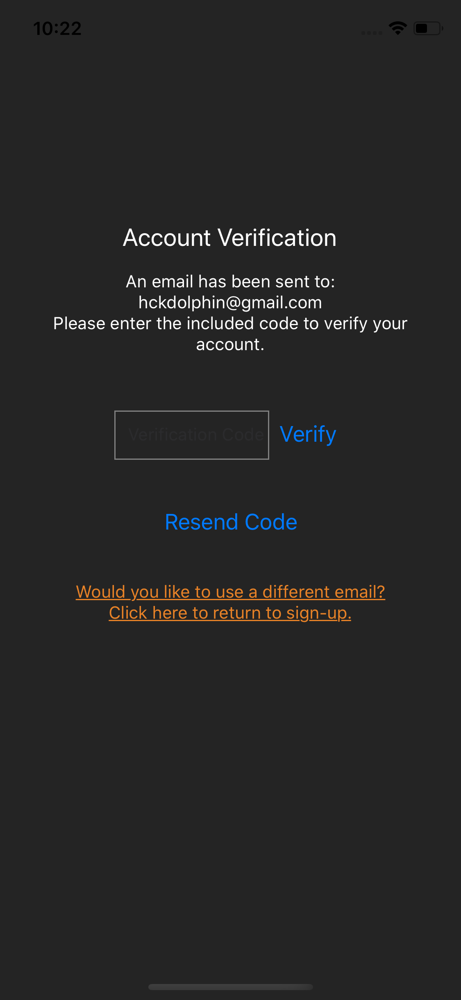
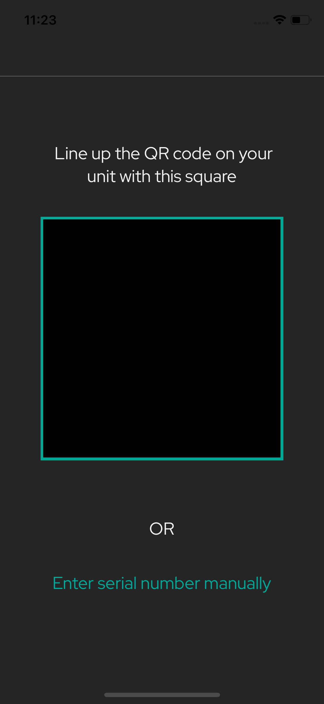
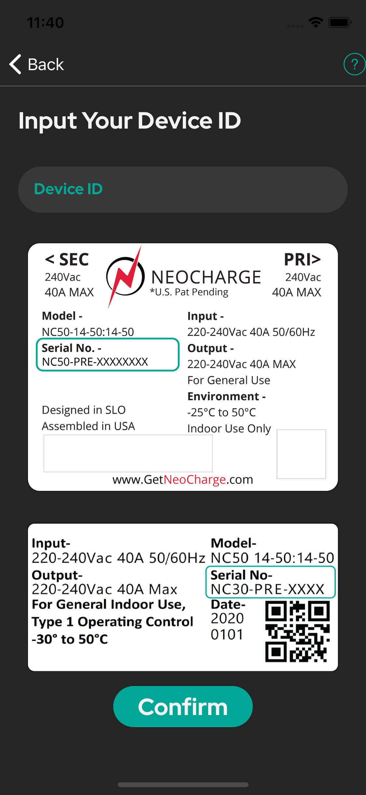
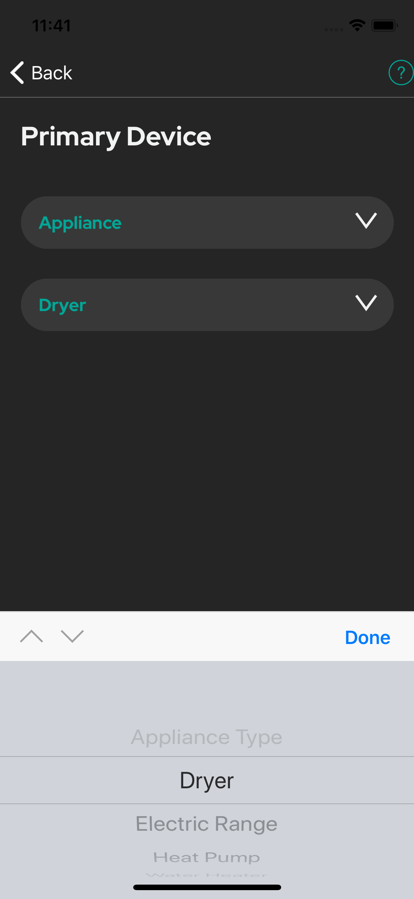
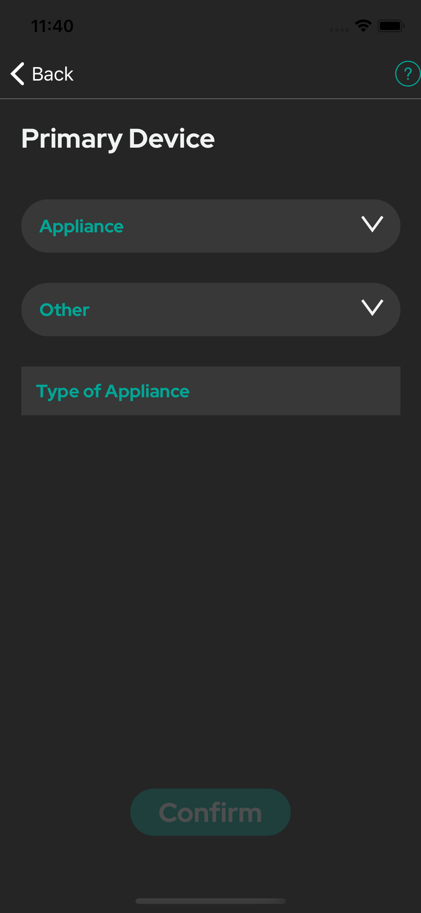
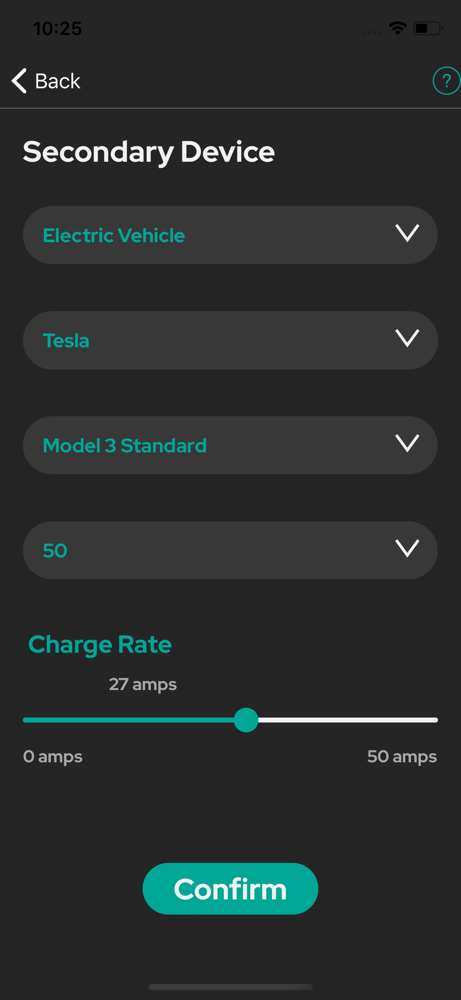
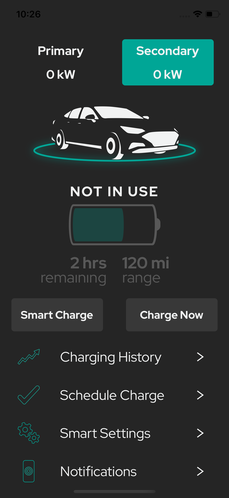

# Setting Up Your NeoCharge App

## First Time Users

To set your NeoCharge Application, you will create an account and register your NeoCharge device. Then, specify the devices you will be charging, and you're ready to go!

For first time users, tap "Create Account".

                       

You will be prompted to create an account in order to register the NeoCharge device with a specific email address.

Fill in the fields, then a verification code will be sent to the entered email. 

                 

Enter this verification code on this screen, then tap "Verify".

                       

Next, you will be taken to the QR Code scanner in order to scan the QR Code found on your NeoCharge device. 

If you are unable to scan the code, you can tap the option to enter the device ID manually, which will take you to the screen below.

                

If the QR scanner did not work, enter the serial number from the label on the back of your NeoCharge device. 

If you are testing the app without a NeoCharge device, please enter 'mydevice' as the sample device id (Keep in mind, functionality will be limited with this id). 

                

Upon successful verification, you will be prompted to specify your time zone as well as your service provider and zip code.

                     

Here you can specify the primary device configuration. If your primary device is an electric vehicle you will need to enter the make, model, and battery size, then specify at which rate you would like to charge the primary device.

                  

If your device is an appliance, specify what kind of appliance it is. If your device is not listed, choose 'Other' and type in the name of your device in the text box.

                    

Here you can specify the secondary device configuration. Similar to the primary device, if your secondary device is also an electric vehicle you will need to specify the make, model, battery size, and charge rate. An example is displayed on the right.

                  

## Returning Users

For returning users, sign in to the app using your login credentials.

                       

After signing in, and you have previously completed the set up process, you will see the app home screen.

<!-- 

To charging history graph will allow you to see how much the car was charged for the day, week, month, and year. 

The schedule charge option will allow you to set a recurring charge for the car. Once the car is plugged in, the car will begin and end charging at the times specified here. 

The settings screen will provide you with information about your account. It will also allow you to change time zones if needed as well as configure your primary and secondary devices. You also have the option to sign out of your account here, which will bring you back to the main sign in page. 

This screen will allow you to select the notifications you would like to recieve on your mobile device.  -->